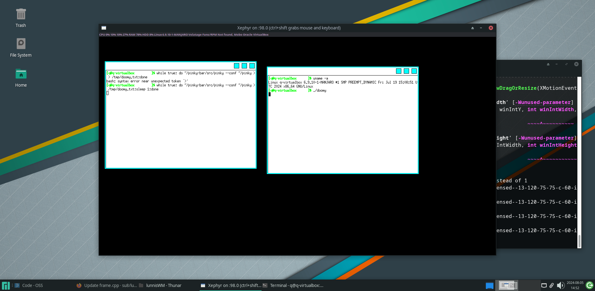

# lunnisWM
Dead simple window manager written in c++, based on steveWM

The bar/statusline is from my other project https://github.com/su8/doomy

# Compile and run

```bash
make -j8 # where 8 are CPU cores

chmod +x run.sh
./run.sh
```

# Requirements

g++/clang

xterm

xorg librares and headers

xephyr

xrandr

# Keyboard shortcuts

alt + 1 executes **xterm**

ctrl + shift focuses the opened xephyr window

alt + tab changes windows focus

alt + escape quits the WM

alt + right mouse buttons resizes the current window

# Testing needed

lunnisWM needs some testing before one option to be merged.

https://github.com/su8/lunnisWM/blob/e8d9c80c359d26d36c3b7a8b2cd360f206744c19/windowManager.cpp#L29

https://github.com/su8/lunnisWM/blob/e8d9c80c359d26d36c3b7a8b2cd360f206744c19/windowManager.cpp#L83-L86

Just uncomment it and open up some windows inside the WM and press alt + w to close them to test it out. Open up a issue and tell me whether if it's working or not.
