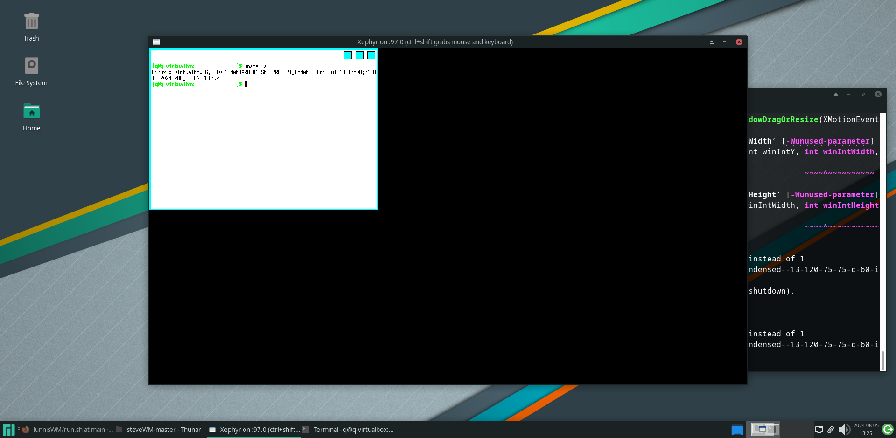

# lunnisWM
Dead simple window manager written in c++, based on steveWM

# Compile and run

```bash
make -j8 # where 8 are CPU cores

chmod +x run.sh
./run.sh
```

# Requirements

g++/clang

xterm

xorg librares and headers
